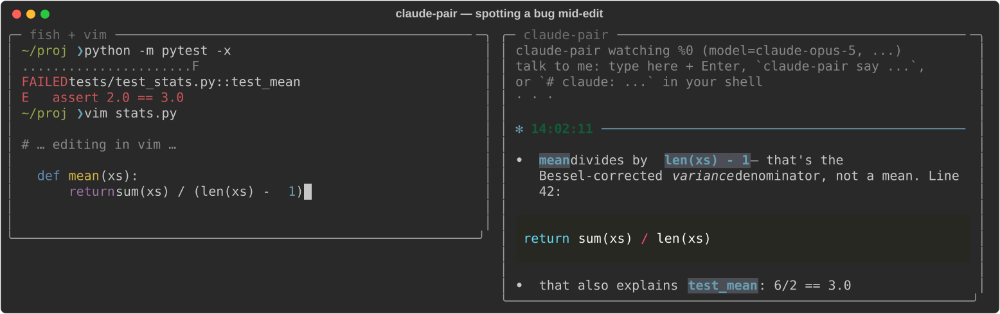
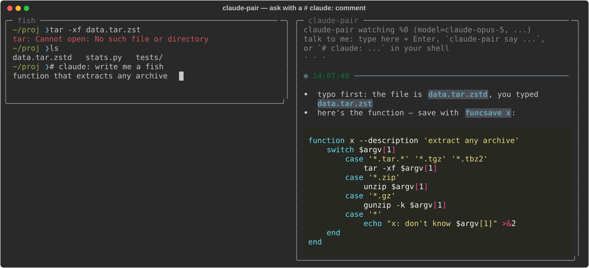

# claude-pair

A Claude pair programmer that looks over your shoulder in tmux. It watches the
pane you're working in — commands, output, even half-typed un-executed command
lines — and streams suggestions into a side pane when (and only when) it has
something worth saying. With the vim plugin installed it also sees the code
around your cursor, including unsaved edits.



Ask it something directly with a `# claude:` comment at your prompt (a fish
no-op), and pull the answer's code straight into vim with `<leader>cl`:



(Screenshots are generated from the real rendering code by
`docs/make_screenshots.py`.)

## How it works

- Follows your **active pane**: whatever pane you're working in (across
  windows too) is what it watches, re-resolved every poll. Its own side pane
  is excluded, so clicking in to type it a message doesn't confuse it.
  `--pin` locks it to the launch pane instead.
- When you're on a **different window** than the watcher pane, a real
  suggestion pings the tmux status line (`✻ claude-pair: … (:cl / claude-pair
  last)`) so you know to pull it up — no ping when the side pane is already
  in view. `--no-notify` turns it off.
- Polls `tmux capture-pane` about once a second (visible screen + a little
  scrollback, so it sees the command line as you type it).
- When the pane content changes and then goes quiet for ~1.5s (debounced),
  it sends a snapshot to Claude, with a rolling conversation history so it
  remembers what it already told you.
- Claude is instructed to reply `SKIP` unless it spots something genuinely
  useful — a typo in the command you're about to run, a fix for the error
  that just scrolled by, a dangerous command, a bug in the code on screen.
  SKIPs render as a quiet `·`; real suggestions stream in under a timestamp.
- Prompt caching keeps the repeated context cheap; only new snapshot content
  is billed at full input price.
- Output is rendered with [rich](https://github.com/Textualize/rich):
  suggestions are light markdown, so bullets render as bullets and fenced
  code blocks (```python, ```fish, …) are syntax-highlighted as they stream
  in. `--theme` picks the pygments theme (default `monokai`).

## Install

```sh
pip install -e .           # from this repo; installs the `claude-pair` command
```

Authentication: set `ANTHROPIC_API_KEY`, or log in once with
[`ant auth login`](https://platform.claude.com/docs/en/api/sdks/cli) — the SDK
picks up the profile automatically.

```fish
set -Ux ANTHROPIC_API_KEY sk-ant-...
```

To update later:

```sh
claude-pair update
```

That pulls this repo, reinstalls if anything changed, and runs
`vim +PlugUpdate` to refresh vim-plug's copy of the plugin (a no-op if you
don't use vim-plug).

### Vim plugin

Copy or symlink `vim/plugin/claude_pair.vim` into your plugin directory, or
point your plugin manager at this repo:

```vim
" vim-plug
Plug 'you/tmux-claude-continuous', {'rtp': 'vim'}
```

The plugin writes cursor/file/buffer state to
`~/.cache/claude-pair/vim_state.json` on `CursorHold`, `InsertLeave`,
`BufEnter`, and `BufWritePost`. It makes no network calls. For fresher state
while you pause mid-edit, lower `updatetime`:

```vim
set updatetime=1000
let g:claude_pair_context_lines = 60   " lines of buffer context (default 60)
```

`:ClaudePairToggle` turns state-writing off/on.

## Use

Inside tmux, in the pane you want watched:

```sh
claude-pair
```

That splits a 60-column side pane (focus stays where you are) and starts
watching. Ctrl-C in the side pane (or just kill the pane) stops it.

### Hiding and showing the pane

Reclaim the screen space without stopping the watcher — it keeps running and
following you while hidden, and any suggestions are waiting when you bring it
back (plus the status-line ping fires while it's out of view):

```fish
claude-pair hide     # stash the pane into a holding window
claude-pair show     # bring it back next to your current pane
claude-pair toggle   # whichever applies
```

A one-key toggle in `~/.tmux.conf`:

```tmux
bind h run-shell "claude-pair toggle"   # prefix + h hides/shows claude-pair
```

When run from a binding like this, confirmations (`✻ claude-pair hidden`)
appear briefly on the tmux status line — never as the blocking view-mode
overlay that needs dismissing. Typed in a shell, they print normally.

(Under the hood it's tmux `break-pane`/`join-pane`; the process never
restarts, so conversation history and loaded context survive.)

### Talking to it

Three ways to ask it something directly (direct messages are always answered
— no `SKIP` — and skip the debounce/cooldown):

- **Type in the watcher pane.** Jump into the side pane, type a message, hit
  Enter.
- **`claude-pair say "why did that fail?"`** from any pane or script. Messages
  land within a second.
- **A shell comment in your work pane.** Type `# claude: how do I undo the
  last commit?` at the prompt — in fish that's a no-op comment, but the
  watcher sees it on screen and answers it once.

### Vim files are loaded automatically

With the vim plugin installed, the watcher automatically keeps the **full
saved contents of your last 5 vim files** (current file included) in Claude's
context — no manual loading. Details that matter:

- Contents are read **from disk on save**, not from the buffer per
  keystroke — so the prompt cache is only invalidated when you `:w`, and
  the loaded files bill at ~10% cached rates between saves. Unsaved edits
  are still visible to Claude via the cursor-region block in each snapshot.
- `--vim-files N` tunes the count (`0` disables);
  `let g:claude_pair_recent_files = 20` sets how many vim remembers.
- Files with secret-looking names (`.env*`, `*secret*`, `*credential*`,
  `*token*`, `*.pem`, `id_rsa`, `*_history`, …) are **never auto-loaded**.
  Use `claude-pair context add` if you genuinely want one loaded.
- The total rides under `--context-budget`; overflow files are skipped
  with a note, never silently.

`:ClaudeContext` (`<leader>cc`) still exists for pinning a file into the
*manual* context store — useful for reference files you're not editing.

### Loading extra context

Give Claude reference material to consult — the file you're working in, or a
few source files it should understand — beyond what's on screen. Loaded
context is a *content snapshot* (captured when you load it) and rides along
as a **prompt-cached prefix**, so after the first call it's billed at ~10% —
cheap to keep loaded.

- **At launch:** `claude-pair --context stats.py --context jax/_src/numpy/`
  (repeatable; files or directories). Replaces any previously-loaded
  context.
- **While running, from any pane:**
  ```fish
  claude-pair context add path/to/file.py   # or a directory
  claude-pair context list
  claude-pair context clear
  ```
  The watcher picks up changes within a second (`→ context updated`).
- **From vim:** `:ClaudeContext` (`<leader>cc`) sends the **whole current
  file** — the full buffer, not just the cursor region the plugin streams by
  default. Re-run it to refresh after big edits.

Directories are walked with the usual noise skipped (`.git`,
`__pycache__`, `node_modules`, binaries, …) up to `--context-budget` chars
per path (default 120k ≈ 30k tokens); anything over budget is **skipped with
a note**, never silently dropped.

**On whole codebases:** a large library like jax (1M+ tokens) won't fit in
context, so point `--context` at the *specific* files or subdirectory you're
touching, not the whole tree — the budget guard protects you either way. And
Claude already knows popular libraries like jax well from training, so you
often only need to load *your* code, not theirs.

### Recalling the last suggestion

Every real suggestion (not the `SKIP`s) is saved under `~/.cache/claude-pair/`:
the full text in `last_suggestion.txt`, just the fenced code blocks in
`last_code.txt`, and a running history in `suggestions.log`. The model is
told fences are the deliverable — paste-ready code, prose stays outside — so
"the code part" is well defined.

- **In vim:** `:ClaudeLast` (`<leader>cl`) pastes the code from the latest
  suggestion at your cursor and reports how many lines it inserted. Undo with
  a single `u` as usual. `:ClaudeLastShow` (`<leader>cs`) opens the *full*
  suggestion — prose included — in a small markdown scratch split with
  syntax-highlighted code blocks (`q` closes it;
  `g:markdown_fenced_languages` defaults to `python, fish, sh, vim`). Set
  `let g:claude_pair_default_mappings = 0` to opt out of both mappings, or
  map `<Plug>(ClaudePairLast)` / `<Plug>(ClaudePairShow)` yourself.
- **In fish (or any shell):** `claude-pair last` renders the full suggestion
  (colors on a tty, plain when piped); `claude-pair last --code` prints just
  the raw code — handy as `claude-pair last --code | fish_clipboard_copy`.
  A `claude-last` wrapper function ships in `fish/functions/` — copy or
  symlink it into `~/.config/fish/functions/` if you want the shorter name.

Useful flags (pass them to `claude-pair`; they're forwarded to the watcher):

| flag | default | meaning |
|---|---|---|
| `--pin` | off | watch only the launch/`--target` pane instead of following the active one |
| `--no-notify` | on | disable the tmux status-line ping when you're on another window |
| `--context PATH` | — | file/dir to load as reference context (repeatable) |
| `--context-budget` | `120000` | max chars loaded per context path |
| `--vim-files` | `5` | auto-load the last N vim files' saved contents (0 = off) |
| `--away` | `60` | minutes of inactivity before a welcome-back recap (0 = off) |
| `--journal-every` | `30` | minutes of work per journal checkpoint (0 = journaling off) |
| `--model` | `claude-opus-5` | any Claude model id (`CLAUDE_PAIR_MODEL` env var also works) |
| `--effort` | `low` | reasoning effort per suggestion; raise for deeper reviews |
| `--think` | off | let the model think before answering (deeper, slower) |
| `--timing` | off | print time-to-first-token and total per call |
| `--theme` | `monokai` | pygments theme for code blocks (`dracula`, `ansi_dark`, …) |
| `--debounce` | `0.25` | seconds of quiet after a change before asking Claude |
| `--cooldown` | `2` | minimum seconds between API calls |
| `--scrollback` | `50` | extra history lines beyond the visible screen |
| `--history` | `8` | snapshot/reply pairs Claude remembers |
| `--width` | `60` | side pane width |
| `--dry-run` | | print the snapshots instead of calling the API |

A tmux binding makes it one keystroke:

```tmux
# ~/.tmux.conf — prefix + P starts the pair programmer for the current pane
bind P run-shell "tmux send-keys 'claude-pair' Enter"
```

### The journal

claude-pair keeps a running, human-readable journal of your work — high
level, one entry per work stretch, not a log of every command:

```markdown
## 2026-07-14

- 14:31 Worked on the stats module: chased the failing test_mean down to
  an off-by-one in mean(); fixed it, tests green. Left off starting the
  variance refactor.
- 16:05 Iterated on the parser branch with claude-pair's suggestions;
  left off mid-rewrite of parse_expr with two cases still failing.
```

It lives at `~/.local/share/claude-pair/journal.md` (a real file — grep it,
edit it, keep it forever). `claude-pair journal` shows the tail
(`claude-pair journal 50` for more).

Entries are written at natural boundaries: when you **step away** (so the
entry can say where you left off), every `--journal-every` minutes of
active work (default 30) as a checkpoint, and when the **watcher exits**.
Each entry is one small extra API call over the already-cached conversation
history, and the model sees its recent entries so it continues the story
rather than repeating it. `--journal-every 0` disables journaling.

Claude also reads the journal tail when its own memory is missing — at
watcher startup and in welcome-back recaps — so context survives restarts.

### Welcome-back recaps

Step away for an hour and the first thing Claude does when you return is
re-ground you: what you were working on, the state you left it in (that test
still failing, that command half-typed), and a suggested next step — drawn
from its memory of your last snapshots before the break. Tune with
`--away MINUTES` (default 60; `0` disables).

This also works across restarts: **open claude-pair fresh on Monday morning**
(or after a few hours away) and, if the journal's last entry is older than
the `--away` threshold, it greets you with a *"✻ where you left off
(2 days ago)"* brief — a couple of lines summarizing your recent journal
(what you were doing, where you stopped, the obvious next step), written by
one small API call over the journal tail. That call doubles as a prompt-cache
pre-warm, so your first real suggestion is faster and cheaper. If the call
can't be made (offline, no key yet), it falls back to printing the raw
journal tail and lets your first snapshot carry a model recap instead.

Away time is measured by your last real tmux keypress (`#{client_activity}`),
so background output landing in a pane while you're gone doesn't count as
"you're back" — and it's wall-clock based, so suspending your laptop counts
as being away.

## Tips

- **Terminal question → code in your buffer.** Type
  `# claude: write a fish function that ...` at your prompt, wait for the
  suggestion, then hit `<leader>cl` in vim. Question asked in the terminal,
  answer landed at your cursor.
- **Clipboard:** `claude-pair last --code | fish_clipboard_copy`.
- **Fresher vim context:** `set updatetime=1000` so the plugin writes state
  after 1s pauses instead of the default 4s.
- **Pane focus:** the side pane never steals focus; SKIPs show as a dim `·`
  so you can see it's alive without reading it.
- **Tune the chattiness** in `SYSTEM_PROMPT` (`claude_pair/watcher.py`) —
  the "worth interrupting for" list is the dial.

## Latency

Suggestions feel snappier or laggier depending on three things — network,
model thinking, and model speed:

- **Thinking is off by default** (`--no-think`). A glance-over-your-shoulder
  tool rarely needs the model to reason first, and skipping it cuts the pause
  before the first token — especially on the common SKIP. `--think` turns it
  back on for a deeper (slower) session.
- **`--timing`** prints `⧗ 0.9s→first · 1.4s total` after each call. If
  time-to-first-token is high, it's the network (a tether, a train); if TTFT
  is low but total is high, it's generation — try a lower effort or a
  smaller model.

Snappiest of all is just a faster model — `--model claude-haiku-4-5` is still
Claude, and dramatically quicker for this kind of quick-take task.

## Cost note

Default settings call the API on every pause in activity, with Opus. With
`--debounce 0.25` and `--cooldown 2` that's up to ~30 calls/minute while
you're actively working — the cooldown is the effective rate limiter. Prompt
caching keeps repeated context ~10x cheaper, but if you leave it running all
day and want it cheaper still, drop the model
(`--model claude-sonnet-5` or `claude-haiku-4-5`) or raise
`--debounce`/`--cooldown`.

## Troubleshooting

- **`run this inside a tmux session`** — the launcher needs `$TMUX`; start
  tmux first.
- **No vim context in suggestions** — check that
  `~/.cache/claude-pair/vim_state.json` updates while you edit (the watcher
  ignores it after 2 minutes of staleness), and that the plugin loaded
  (`:echo g:loaded_claude_pair`).
- **Too chatty / too quiet** — chattiness lives in the system prompt in
  `claude_pair/watcher.py` (`SYSTEM_PROMPT`); tune the "worth interrupting
  for" list to taste.
